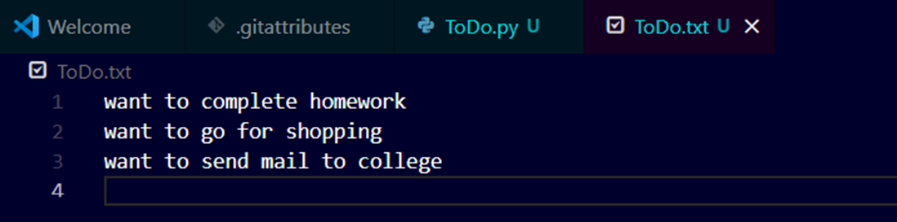
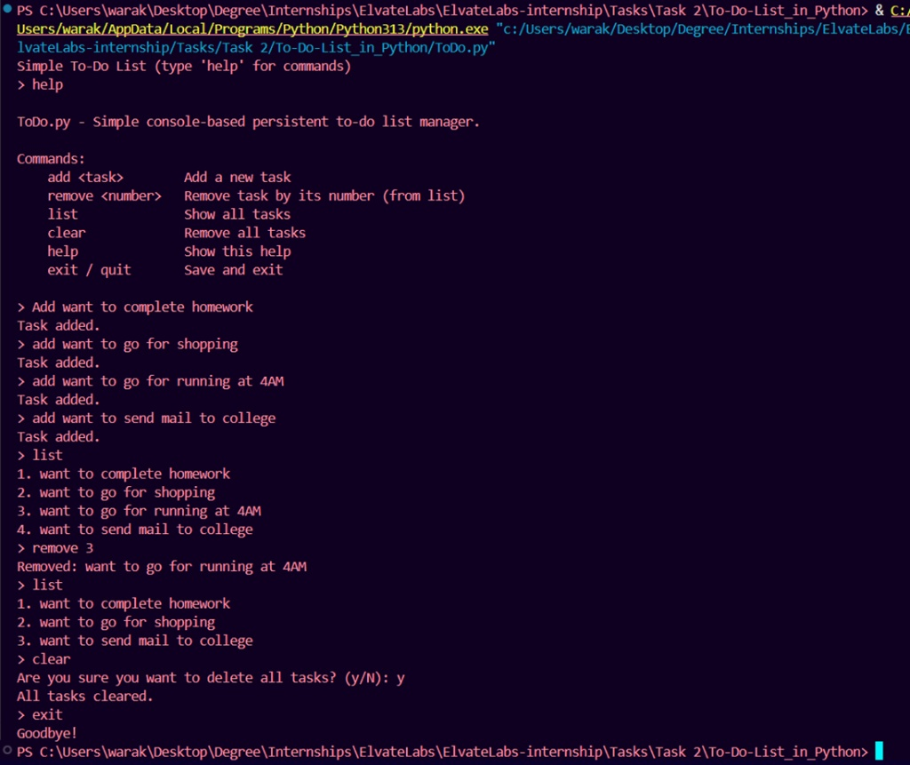

# 🧮 Python To-Do List Project

---


---

## 📘 Project Overview
This is a **console-based To-Do List Manager** built using Python.  
It allows users to **add, view, remove, and clear tasks** through simple text commands in the terminal.

## ⚙️ Features
- Add new tasks  
- View all existing tasks  
- Remove specific tasks by number  
- Clear all tasks with confirmation  
- Persistent storage using a text file  
- Input validation and error handling  

## 🧠 How It Works
- Tasks are stored in a **Python list** during runtime.  
- All tasks are saved to a **text file** (`todo.txt`) for persistence using the `open()` function.  
- The program accepts simple commands like `add`, `remove`, `list`, `clear`, and `help`.

## 💻 Technologies Used
- **Language:** Python 3  
- **Editor/Tools:** VS Code / Terminal  

## 🚀 Outcome
A fully functional **Command-Line To-Do List App** that keeps your tasks saved even after exiting the program.

---

## 🧑‍💻 Code Implementation

```python
"""
ToDo.py - Simple console-based persistent to-do list manager.

Commands:
    add <task>        Add a new task
    remove <number>   Remove task by its number (from list)
    list              Show all tasks
    clear             Remove all tasks
    help              Show this help
    exit / quit       Save and exit
"""

from pathlib import Path

# DATA_FILE will store tasks in a text file next to this script (e.g., ToDo.txt)
DATA_FILE = Path(__file__).with_suffix('.txt')


# ---------------------- Load tasks from file ----------------------
def load_tasks():
    """Load all saved tasks from the text file into a list."""
    if not DATA_FILE.exists():
        return []
    with DATA_FILE.open('r', encoding='utf-8') as f:
        # Strip newlines and ignore empty lines
        return [line.strip() for line in f if line.strip()]


# ---------------------- Save tasks to file ----------------------
def save_tasks(tasks):
    """Save the current list of tasks to the file."""
    with DATA_FILE.open('w', encoding='utf-8') as f:
        for t in tasks:
            f.write(t + '\n')


# ---------------------- List all tasks ----------------------
def list_tasks(tasks):
    """Display all tasks with numbering."""
    if not tasks:
        print("No tasks.")
        return
    for i, t in enumerate(tasks, start=1):
        print(f"{i}. {t}")


# ---------------------- Add a new task ----------------------
def add_task(tasks, text):
    """Add a new task to the list and save it."""
    text = text.strip()
    if not text:
        print("Cannot add an empty task.")
        return
    tasks.append(text)
    save_tasks(tasks)
    print("Task added.")


# ---------------------- Remove a task ----------------------
def remove_task(tasks, index_str):
    """Remove a specific task by its number."""
    try:
        idx = int(index_str)
    except ValueError:
        print("Provide the task number to remove, e.g. remove 2")
        return

    if not (1 <= idx <= len(tasks)):
        print("Task number out of range.")
        return

    removed = tasks.pop(idx - 1)
    save_tasks(tasks)
    print(f"Removed: {removed}")


# ---------------------- Clear all tasks ----------------------
def clear_tasks(tasks):
    """Delete all tasks after user confirmation."""
    confirm = input("Are you sure you want to delete all tasks? (y/N): ").strip().lower()
    if confirm == 'y':
        tasks.clear()
        save_tasks(tasks)
        print("All tasks cleared.")
    else:
        print("Canceled.")


# ---------------------- Show help ----------------------
def print_help():
    """Print help instructions (from the docstring)."""
    print(__doc__)


# ---------------------- Main Function ----------------------
def main():
    """Main loop: continuously accept user commands and perform actions."""
    tasks = load_tasks()
    print("Simple To-Do List (type 'help' for commands)")

    while True:
        try:
            raw = input("> ").strip()
        except (EOFError, KeyboardInterrupt):
            print("\nExiting.")
            break

        if not raw:
            continue  # Ignore empty input

        parts = raw.split(maxsplit=1)
        cmd = parts[0].lower()
        arg = parts[1] if len(parts) > 1 else ""

        if cmd in ('exit', 'quit'):
            break
        elif cmd == 'help':
            print_help()
        elif cmd == 'list':
            list_tasks(tasks)
        elif cmd == 'add':
            if arg:
                add_task(tasks, arg)
            else:
                todo = input("Task: ").strip()
                add_task(tasks, todo)
        elif cmd == 'remove':
            if arg:
                remove_task(tasks, arg)
            else:
                num = input("Task number to remove: ").strip()
                remove_task(tasks, num)
        elif cmd == 'clear':
            clear_tasks(tasks)
        else:
            print("Unknown command. Type 'help' for usage.")

    # Save tasks again before exiting
    save_tasks(tasks)
    print("Goodbye!")


# ---------------------- Program Entry Point ----------------------
if __name__ == "__main__":
    main()
```

---

## 🖥️ Output Screenshot




---

<h1 align="center">📘 Python File Handling & Data Structure Basics</h1>

---

## 1. How do you open and write to a file in Python?
You use the built-in `open()` function and typically write using the `.write()` or `.writelines()` methods.  
It's best practice to use a **`with` statement** to ensure the file is automatically closed:

```python
with open('my_file.txt', 'w') as f:
    f.write('Hello, world!\n')
```

---

## 2. What are common file modes?
The most common file modes are:

| Mode | Description |
|------|--------------|
| `'r'` | Read (default) |
| `'w'` | Write (overwrites existing file or creates new) |
| `'a'` | Append (adds to the end of the file) |
| `'x'` | Exclusive creation (fails if the file already exists) |
| `'b'` | Binary mode (e.g., `'rb'`, `'wb'`) |
| `'t'` | Text mode (default, e.g., `'rt'`, `'wt'`) |
| `'+'` | Updating (read and write, e.g., `'r+'`, `'w+'`) |

---

## 3. What's the use of `.strip()`?
The `.strip()` string method removes **leading and trailing whitespace** (spaces, newlines, tabs) from a string.  
You can also pass a string of characters to remove specific ones instead of just whitespace.

---

## 4. How do lists work in Python?
Lists are **ordered, mutable collections** of items (which can be of different data types).  
They are defined using **square brackets `[]`** and allow duplicate elements.  
They support indexing, slicing, and dynamic modification.

---

## 5. What is the difference between `append()` and `insert()`?
- `list.append(item)` → Adds the item to the **end** of the list.  
- `list.insert(index, item)` → Adds the item at a **specific index** in the list.

---

## 6. How can you remove elements from a list?
- `list.remove(value)` → Removes the **first occurrence** of a value.  
- `list.pop(index)` → Removes and returns the **element at the given index** (or last item if no index is given).  
- `del list[index/slice]` → Deletes an element at a specific index or a slice of elements.

---

## 7. What are context managers (`with` statement)?
Context managers handle setup and cleanup actions automatically.  
Using `with` ensures that resources (like files or locks) are **properly released** even if an error occurs.

Example:
```python
with open('data.txt', 'r') as f:
    data = f.read()
```

---

## 8. How do you loop through a file line by line?
The most memory-efficient and Pythonic way is to iterate directly over the file object:

```python
with open('my_file.txt', 'r') as f:
    for line in f:
        print(line.strip())
```

---

## 9. What is a data structure?
A **data structure** is a format for organizing, managing, and storing data efficiently.  
Examples: **Lists, Dictionaries, Stacks, Queues, Trees**

---

## 10. What happens if the file doesn't exist?
- Opening in **read mode (`'r'`)** → raises `FileNotFoundError`  
- Opening in **write (`'w'`)** or **append (`'a'`)** mode → creates a **new empty file**  
- Opening in **exclusive creation mode (`'x'`)** → raises `FileExistsError` if file already exists

---

## 🧑‍🏫 Author
**Prathamesh Sitaram Warak**  
B.E. Information Technology | Atharva College of Engineering  
Passionate about coding, cybersecurity,AI-ML and building real-world tech projects.
